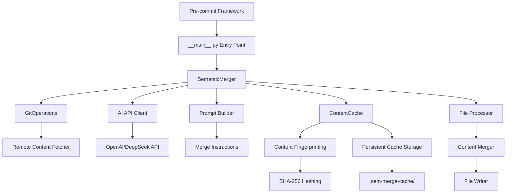

# System Patterns: sem-merge

## Architecture Overview

### Component Architecture

### Core Components

#### 1. Entry Point (`__main__.py`)
- **Purpose**: Interface between pre-commit framework and application logic
- **Responsibilities**: 
  - Environment validation (API key check)
  - File path processing from command line arguments
  - Error handling and graceful degradation
- **Pattern**: Command Pattern with async execution

#### 2. SemanticMerger (`merger.py`)
- **Purpose**: Orchestrates the semantic merging process
- **Responsibilities**:
  - Coordinate git operations and API calls
  - Manage concurrent file processing
  - Handle merge workflow logic
  - **NEW**: Integrate content caching for deterministic behavior
- **Pattern**: Facade Pattern with async processing + Dependency Injection

#### 3. GitOperations (`git_ops.py`)
- **Purpose**: Abstracts git repository interactions
- **Responsibilities**:
  - Fetch remote main branch content
  - Handle repository access and file retrieval
  - Manage git errors gracefully
- **Pattern**: Repository Pattern with error handling

#### 4. **ContentCache (`cache.py`) - NEW**
- **Purpose**: Prevents infinite processing loops through content fingerprinting
- **Responsibilities**:
  - Generate SHA-256 hashes of content combinations
  - Store and retrieve cached merge results
  - Handle cache expiration and cleanup
  - Provide persistent storage with graceful fallback
- **Pattern**: Repository Pattern + Strategy Pattern for storage

#### 5. Prompt Builder (`prompts.py`)
- **Purpose**: Constructs AI prompts for semantic merging
- **Responsibilities**:
  - Format content for AI processing
  - Provide clear merge instructions
  - Ensure consistent prompt structure
- **Pattern**: Builder Pattern

## Key Technical Decisions

### 1. Pre-commit Framework Integration
**Decision**: Focus exclusively on pre-commit framework integration
**Rationale**: 
- Leverages existing ecosystem and user familiarity
- Handles file filtering and execution environment
- Provides standardized hook interface
- Eliminates need for custom CLI tooling

### 2. Async Processing Architecture
**Decision**: Use asyncio for concurrent file processing
**Rationale**:
- Improves performance with multiple files
- Non-blocking I/O for API calls
- Better resource utilization
- Maintains responsiveness during processing

### 3. DeepSeek R1 via OpenAI-Compatible API
**Decision**: Use OpenAI SDK with DeepSeek endpoints
**Rationale**:
- Mature, well-tested SDK
- Consistent API interface
- Easy to switch between models
- Good error handling and retry logic

### 4. Fail-Safe Error Handling
**Decision**: Never block commits, always return success
**Rationale**:
- Preserves development workflow
- Reduces adoption friction
- Provides graceful degradation
- Maintains developer productivity

### 5. Type Safety with Selective Ignoring
**Decision**: Use pyrefly with targeted type ignores
**Rationale**:
- Catches most type errors early
- Allows flexibility with external APIs
- Maintains code quality
- Balances safety with practicality

## Design Patterns

### 1. Command Pattern
- **Implementation**: `__main__.py` entry point
- **Benefits**: Clean separation between framework and application logic
- **Usage**: Processes pre-commit file arguments and delegates to merger

### 2. Facade Pattern
- **Implementation**: `SemanticMerger` class
- **Benefits**: Simplifies complex subsystem interactions
- **Usage**: Coordinates git operations, API calls, and file processing

### 3. Repository Pattern
- **Implementation**: `GitOperations` class
- **Benefits**: Abstracts data source (git repository) from business logic
- **Usage**: Provides clean interface for remote content retrieval

### 4. Strategy Pattern (Implicit)
- **Implementation**: Configurable models via environment variables
- **Benefits**: Allows different AI models without code changes
- **Usage**: `DEEPSEEK_MODEL` environment variable

### 5. Builder Pattern
- **Implementation**: `build_merge_prompt` function
- **Benefits**: Consistent prompt construction
- **Usage**: Creates structured prompts for AI processing

### 6. Content Fingerprinting Pattern (NEW)
- **Implementation**: SHA-256 hashing of content combinations
- **Benefits**: Deterministic behavior and infinite loop prevention
- **Usage**: `ContentCache._content_hash()` method

### 7. Cache-Aside Pattern (NEW)
- **Implementation**: Manual cache management in `SemanticMerger`
- **Benefits**: Application controls caching logic with fallback to origin
- **Usage**: Check cache → miss → process → store → return

### 8. TTL (Time-To-Live) Pattern (NEW)
- **Implementation**: 24-hour expiration with configurable constants
- **Benefits**: Handles edge cases while preventing stale data
- **Usage**: `CACHE_EXPIRATION_SECONDS` constant

## Component Relationships

### Data Flow
1. **Input**: Pre-commit passes modified file paths
2. **Processing**: Each file is processed concurrently
3. **Git Operations**: Fetch remote version for comparison
4. **AI Processing**: Generate semantic merge via DeepSeek
5. **Output**: Update staged files with merged content

### **Cache-Enhanced Data Flow (NEW)**
1. **Input**: Pre-commit passes modified file paths
2. **Processing**: Each file is processed concurrently
3. **Git Operations**: Fetch remote version for comparison
4. **Content Fingerprinting**: Generate SHA-256 hash of content combination
5. **Cache Check**: Look for existing merge result
6. **Cache Hit**: Return cached result (skip AI processing)
7. **Cache Miss**: Generate semantic merge via AI API
8. **Cache Store**: Persist merge result for future use
9. **Output**: Update staged files with merged content

### **Cache Storage Strategy**
- **Key Generation**: `SHA-256(file_path + local_content + remote_content)`
- **Storage Format**: JSON with metadata (timestamp, file_path)
- **Location**: `.sem-merge-cache/processed.json`
- **Persistence**: Survives across git operations and tool restarts
- **Expiration**: 24-hour TTL with automatic cleanup

### Error Handling Strategy
- **Git Errors**: Skip file processing, continue with others
- **API Errors**: Log warning, skip file processing
- **File Errors**: Handle gracefully, don't block commit
- **Network Errors**: Fail silently, preserve workflow

### Configuration Strategy
- **Environment Variables**: Primary configuration method
- **Pre-commit Config**: File filtering and execution control
- **Defaults**: Sensible defaults for zero-configuration usage
- **Validation**: Early validation with helpful error messages

## Testing Architecture

### Unit Testing Pattern
- **Mock External Dependencies**: Git operations and API calls
- **Test Individual Components**: Each class tested in isolation
- **Async Test Support**: Uses pytest-asyncio for async testing
- **Fixture-Based Setup**: Reusable test fixtures

### Integration Testing Pattern
- **Real API Calls**: Tests with actual DeepSeek API
- **Conditional Execution**: Skipped when API key not available
- **Content Validation**: Verifies merge quality and structure
- **End-to-End Scenarios**: Tests complete workflow

### Quality Assurance Pattern
- **Multi-Tool Approach**: ruff, pyrefly, pytest
- **Automated Checks**: Task-based workflow
- **Type Safety**: Comprehensive type annotations
- **Coverage Reporting**: Tracks test coverage 