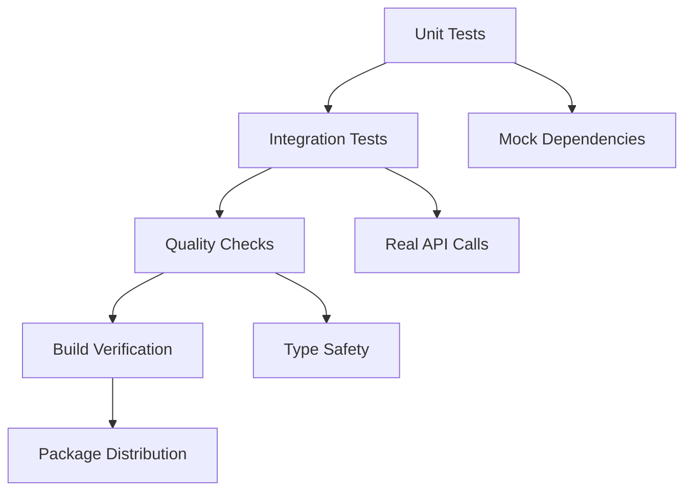

# Technical Context: sem-merge

## Technology Stack

### Core Technologies
- **Python 3.13+**: Latest Python with modern syntax and performance improvements
- **uv**: Ultra-fast Python package manager and virtual environment management
- **ruff**: Lightning-fast linting and formatting (replaces black + flake8)
- **pyrefly**: Static type checker from Meta for comprehensive type safety
- **Taskfile.yml**: Task automation replacing traditional Makefiles

### Key Dependencies

#### Runtime Dependencies
```toml
[project.dependencies]
gitpython = ">=3.1.44"    # Git repository operations
openai = ">=1.82.1"       # DeepSeek API integration via OpenAI SDK
```

#### Development Dependencies
```toml
[dependency-groups.dev]
pytest = ">=8.3.5"           # Testing framework
pytest-asyncio = ">=1.0.0"   # Async test support
pytest-mock = ">=3.14.1"     # Mocking capabilities
pytest-cov = ">=6.1.1"       # Coverage reporting
pyrefly = ">=0.17.1"         # Type checking
ruff = ">=0.11.12"           # Linting and formatting
```

### Architecture Decisions

#### Package Management Strategy
- **uv for Everything**: Package installation, virtual environments, dependency resolution
- **pyproject.toml**: Single configuration file for all project metadata
- **Dependency Groups**: Separate dev dependencies from runtime requirements
- **Lock File**: `uv.lock` ensures reproducible builds

#### Code Quality Stack
- **ruff**: Single tool for linting and formatting (10-100x faster than alternatives)
- **pyrefly**: Advanced type checking with strict mode enabled
- **pytest**: Comprehensive testing with async support
- **Task**: Unified interface for all development operations

#### Pre-commit Integration
- **Standard Compliance**: Follows pre-commit framework conventions exactly
- **Hook Definition**: `.pre-commit-hooks.yaml` defines integration points
- **Entry Point**: `python -m sem_merge` provides clean module execution
- **File Filtering**: Delegates to pre-commit's `files` and `exclude` patterns

## Development Environment

### Project Structure
```
sem-merge/
├── pyproject.toml           # Project configuration
├── .pre-commit-hooks.yaml   # Pre-commit hook definition
├── Taskfile.yml            # Development tasks
├── src/sem_merge/           # Source code
│   ├── __main__.py         # Entry point
│   ├── merger.py           # Core logic
│   ├── git_ops.py          # Git operations
│   └── prompts.py          # AI prompts
├── tests/                  # Test suite
│   ├── test_merger.py      # Unit tests
│   └── test_integration.py # Integration tests
└── memory-bank/            # Project documentation
```

### Environment Variables
```bash
# Required
DEEPSEEK_API_KEY="your-deepseek-api-key"

# Optional Configuration
DEEPSEEK_MODEL="deepseek-r1"        # Default model
DEEPSEEK_MAX_TOKENS="4000"          # Token limit
SEMMERGE_LOG_LEVEL="INFO"           # Logging level
```

### Development Workflow

#### Setup
```bash
# Clone and setup
git clone <repository>
cd sem-merge
uv sync --dev

# Run all checks
task check
```

#### Available Tasks
```yaml
task test                # Unit tests
task test-integration   # Integration tests (requires API key)
task lint               # Ruff linting
task format             # Code formatting
task typecheck          # Pyrefly type checking
task check              # All quality checks
task build              # Package building
```

## API Integration

### DeepSeek R1 Integration
- **SDK**: OpenAI Python SDK for consistent interface
- **Authentication**: API key via environment variable
- **Model Configuration**: Environment-configurable model selection
- **Error Handling**: Graceful fallback when API unavailable
- **Rate Limiting**: Respects API limits with async processing

### Prompt Engineering
```python
def build_merge_prompt(local: str, remote: str, file_path: str) -> str:
    """Constructs clear, specific prompts for semantic merging."""
    # Clear instructions for structure preservation
    # Explicit requirements for duplicate elimination
    # File context for better understanding
```

## Git Integration

### Repository Operations
- **Remote Fetching**: Automatic fetch of origin/main content
- **File Comparison**: Byte-level comparison to detect changes
- **Content Retrieval**: Safe extraction of file content from specific commits
- **Error Resilience**: Graceful handling of network and repository issues

### Git Workflow
1. **Detection**: Identify modified documentation files
2. **Fetching**: Retrieve remote main branch content
3. **Comparison**: Compare local vs remote versions
4. **Processing**: Skip unchanged files automatically
5. **Update**: Write merged content back to staging area

## Testing Strategy

### Multi-Level Testing


#### Unit Testing (`test_merger.py`)
- **Mocked Dependencies**: Git operations and API calls isolated
- **Component Testing**: Each class tested independently
- **Edge Cases**: Error conditions and boundary cases covered
- **Async Patterns**: Proper async/await testing with pytest-asyncio

#### Integration Testing (`test_integration.py`)
- **Real API Calls**: Actual DeepSeek API integration testing
- **Content Validation**: Verifies merge quality and length requirements
- **Conditional Execution**: Automatically skipped without API key
- **End-to-End Scenarios**: Complete workflow validation

#### Quality Assurance
- **Type Safety**: pyrefly strict mode with targeted ignores
- **Code Style**: ruff for consistent formatting and linting
- **Coverage**: pytest-cov for test coverage reporting
- **Performance**: Async processing for optimal speed

## Build and Distribution

### Package Configuration
```toml
[build-system]
requires = ["hatchling"]
build-backend = "hatchling.build"

[project]
name = "sem-merge"
description = "Pre-commit hook for semantic document merging using AI"
requires-python = ">=3.13"
```

### Distribution Strategy
- **Single Method**: Pre-commit framework integration only
- **Standard Format**: Python wheel and source distribution
- **Dependency Management**: Minimal runtime dependencies
- **Platform Support**: OS-independent Python package

### Installation Pattern
```yaml
# User's .pre-commit-config.yaml
repos:
  - repo: https://github.com/your-org/sem-merge
    rev: v1.0.0
    hooks:
      - id: semantic-merge
        files: \.(md|mdc)$
```

## Performance Considerations

### Async Processing Benefits
- **Concurrent Files**: Multiple files processed simultaneously
- **Non-blocking I/O**: API calls don't block other operations
- **Resource Efficiency**: Better CPU and memory utilization
- **Responsiveness**: Maintains system responsiveness during processing

### Optimization Strategies
- **Early Returns**: Skip processing for unchanged files
- **Lazy Loading**: Load dependencies only when needed
- **Error Isolation**: Errors in one file don't affect others
- **Memory Management**: Efficient handling of file content

## Security Considerations

### API Security
- **Environment Variables**: Secure API key storage
- **No Logging**: API keys never logged or exposed
- **HTTPS**: All API communications over secure channels
- **Validation**: Input validation before API calls

### Git Security
- **Read-Only Operations**: No write operations to git repository
- **Safe Fetching**: Secure remote content retrieval
- **Error Boundaries**: Prevent information leakage in error messages
- **Repository Isolation**: Operations scoped to current repository 